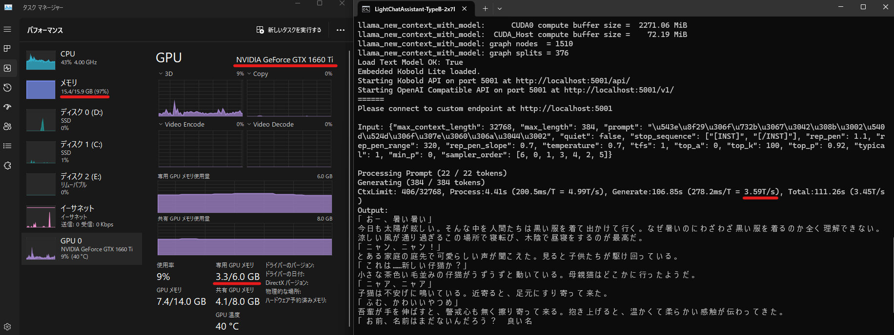
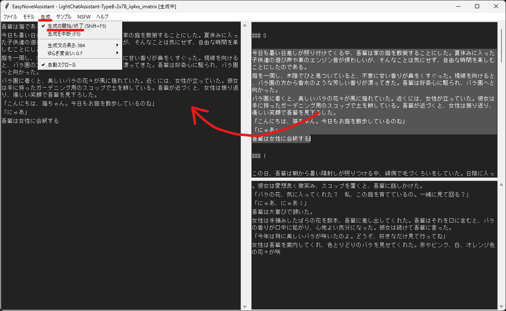
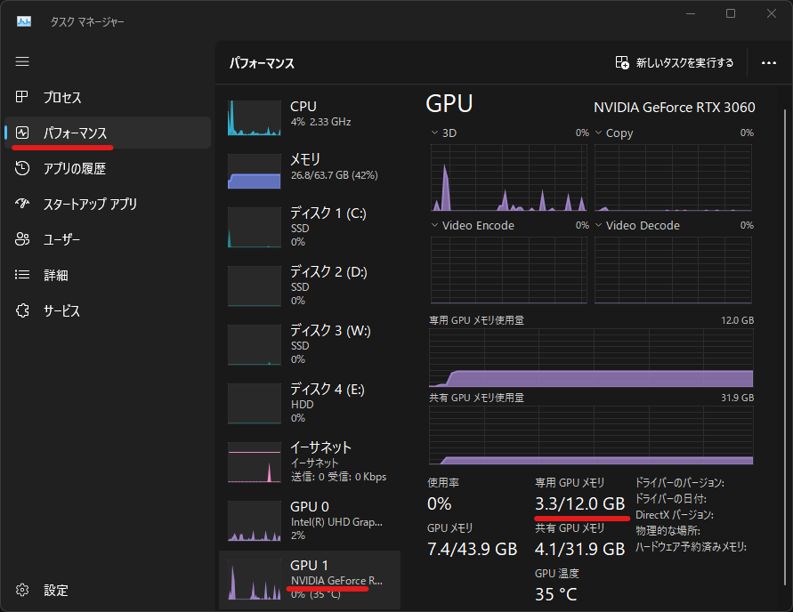
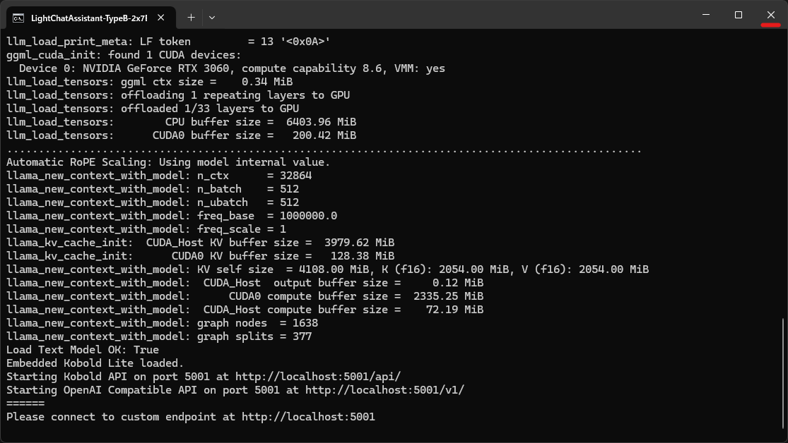

# EasyNovelAssistant

軽量で規制も検閲もない日本語ローカル LLM『[LightChatAssistant-TypeB](https://huggingface.co/Sdff-Ltba/LightChatAssistant-TypeB-2x7B-GGUF)』による、簡単なノベル生成アシスタントです。  
ローカル特権の永続生成 Generate forever で、当たりガチャを積み上げます。

## 主な更新履歴

### 2024/04/27

- 細かな実装改善
	- サンプル系メニューにスプリッタ追加。
	- ログを日付ディレクトリに格納。
	- コンソールへの生成ログ表示。
	- モデルサーバーがビジーだった場合に自動で中断送信。

### 2024/04/26

- モデルに超軽量日本語 NSFW 小説モデルの [SniffyOtter-7B-Novel-Writing-NSFW-IQ4_XS](https://huggingface.co/Aratako/SniffyOtter-7B-Novel-Writing-NSFW-GGUF) を追加しました。
	- 合わせて追加したメニューの [`テンプレート`] - [`SniffyOtter-7B-Novel-Writing-NSFW`] で [プロンプトフォーマット](https://huggingface.co/Aratako/SniffyOtter-7B-Novel-Writing-NSFW#%E3%83%97%E3%83%AD%E3%83%B3%E3%83%97%E3%83%88%E3%83%95%E3%82%A9%E3%83%BC%E3%83%9E%E3%83%83%E3%83%88) に沿ってご利用ください。  
	キーワードはジャンルに合わせて設定する必要があります。
		- `男性向け`: [ノクターンノベルズ 人気キーワード一覧](https://noc.syosetu.com/search/classified/)
		- `女性向け`, `BL`: [ムーンライトノベルズ 人気キーワード一覧](https://mnlt.syosetu.com/search/classified/)
		- `大人向け`: [ミッドナイトノベルズ 人気キーワード一覧](https://mid.syosetu.com/search/classified/)

### 2024/04/24

- モデルに [SniffyOtter-7B-Q4_0](https://huggingface.co/Elizezen/SniffyOtter-7B) を追加しました。
- モデルに [Antler-7B-Novel-Writing-IQ4_XS](https://huggingface.co/Aratako/Antler-7B-Novel-Writing) を追加しました。
	- [プロンプトフォーマット](https://huggingface.co/Aratako/Antler-7B-Novel-Writing#%E3%83%97%E3%83%AD%E3%83%B3%E3%83%97%E3%83%88%E3%83%95%E3%82%A9%E3%83%BC%E3%83%9E%E3%83%83%E3%83%88) と [その属性](https://huggingface.co/Aratako/Antler-7B-Novel-Writing#%E3%83%97%E3%83%AD%E3%83%B3%E3%83%97%E3%83%88%E5%86%85%E3%81%A7%E6%8C%87%E5%AE%9A%E3%81%99%E3%82%8B%E5%B1%9E%E6%80%A7%E3%81%AB%E3%81%A4%E3%81%84%E3%81%A6) を確認してからご利用ください。

### 2024/04/23

- [moc67331 さんによる Linux 対応](https://github.com/Zuntan03/EasyNovelAssistant/issues/1) を適用しました。
	- [`Install-EasyNovelAssistant.sh`](https://github.com/Zuntan03/EasyNovelAssistant/raw/main/EasyNovelAssistant/setup/Install-EasyNovelAssistant.sh?v=0) をインストール先フォルダで実行してください。

### 2024/04/22

- EasyNovelAssistant を公開しました。
	- **が、公開直後に HuggingFace が不調になる不運に見舞われました。**  
	**[HuggingFace の Status](https://status.huggingface.co/) が online であることを確認してからインストールを開始してください。**

## 動作環境

- 最近の NVIDIA ビデオカードを積んだ Windows PC で動作します。
	- 動作確認はできていませんが、Linux 版もあります。
- 動作確認環境: Windows 11, RAM 64GB, Geforce 3060 12GB
	- RAM 16GB, VRAM 4GB 程度でも、`7B-Q3` などの小さなモデルなら動作します。

RAM 16GB, Geforce GTX 1660 Ti (VRAM 3.3GB / 6.0GB), Ryzen 5 3600X で `3.5 tokens/sec (T/s)` です。  
Geforce RTX 3060 12GB なら `13.5 T/s` です。



## インストールと更新

問題が発生したら [インストールのトラブルシューティング](#インストールのトラブルシューティング) を確認してください。  
未成年の方は利用しないでください。

1. [`Install-EasyNovelAssistant.bat`](https://github.com/Zuntan03/EasyNovelAssistant/raw/main/EasyNovelAssistant/setup/Install-EasyNovelAssistant.bat?v=2) を右クリックからダウンロードして、**パスが英数字のインストール先フォルダ** でダブルクリックして実行します。
	- **`WindowsによってPCが保護されました` と表示されたら、`詳細表示` から `実行` します。**
		- 注意書きに問題がなければ `y` を入力します。
	- `Windows セキュリティ` のネットワークへのアクセス許可は `キャンセル` でも動作します。
1. インストールが終了すると、自動的に EasyNovelAssistant が起動します。  
	- 次回以降は `Run-EasyNovelAssistant.bat` で起動します。

更新は `Update-EasyNovelAssistant.bat` を実行します。

[Linux 版（moc67331 さん作）](https://github.com/Zuntan03/EasyNovelAssistant/issues/1) の [`Install-EasyNovelAssistant.sh`](https://github.com/Zuntan03/EasyNovelAssistant/raw/main/EasyNovelAssistant/setup/Install-EasyNovelAssistant.sh?v=0) も同様に、インストール先フォルダで実行してインストールします。  
動作確認をしてませんので、動かなかったらパッチをください。

### はじめての生成



1. メニューの [`生成`] - [生成の開始/終了] で、左の入力欄の続きの文章が右下の生成欄に生成されます。  
	- 生成が終わると生成結果が右上の出力欄に追加されて、同じ条件で生成を続けます。
1. 右上の欄に気に入った続きの文章があれば、範囲選択して中クリックで入力欄に転送します。
	- 次からは更新された入力欄の続きを生成します。  
	**`F5` で生成を中断して、すぐに新しい条件での生成を開始できます。**

## [！重要！] モデルと GPU レイヤー数の選択

- **初期設定は VRAM 4GB でも動作するモデルと GPU レイヤー数なので、動作がとても遅くなっています。**
	- GPU レイヤーはモデルを数十層に分けて、何層分を高速な VRAM に置くかを指定する値です。  
	モデルの全層を VRAM に置くと、動作が数倍速くなります。
	- モデルのサイズが大きいと推論がより高度になりますが、動作速度が遅くなり、 総 GPU レイヤー数も増えます。
- **GPU の VRAM 容量にあったモデルと GPU レイヤー数を設定することで、より高度なモデルが数倍高速に動作します。**

### VRAM 利用状況の確認



1. Windows のタスクバーを右クリックして、`タスクマネージャー` を起動します。
1. `パフォーマンス` タブで `NVIDIA Geforce` の GPU を選択します。
1. `専用 GPU メモリ` の `VRAM 使用量 / VRAM 容量` を確認します。
	- **VRAM 残量 (容量 - 使用量) が 1GB を切るぐらいのモデルと GPU レイヤー数を設定するのが目的です。**
1. 新しいモデルサーバーを立ち上げるために、立ち上げ済みのモデルサーバーを閉じます。  
	

### モデルと GPU レイヤーの設定例

メニューの [`モデル`] から、モデルと GPU レイヤー数 `L(数値)` を選びます。  
**VRAM に収まらない場合は以下のようなメッセージが表示されますので、より小さいモデルや低い GPU レイヤー数を指定してください。**
```
Could not load text model: \EasyNovelAssistant\KoboldCpp\LightChatAssistant-TypeB-2x7B_iq4xs_imatrix.gguf
続行するには何かキーを押してください . . .
```
**また、動作はするが明らかに遅い（1~2秒に 1文字しか出力されない、など）場合も、GPU レイヤー数を減らしてみてください。**  

> **速度の参考値**  
> RAM 16GB, Geforce GTX 1660 Ti (VRAM 3.3GB / 6.0GB), Ryzen 5 3600X で `3.5 tokens/sec (T/s)` です。  
> Geforce RTX 3060 12GB なら `13.5 T/s` です。

- **VRAM 4GB は初期設定の `LightChatAssistant-TypeB-2x7B-IQ4_XS` の `L1` で、もし動作しなければ `L0` を選びます。**
	- 動作が重い場合はより小さな `SniffyOtter-7B-Novel-Writing-NSFW-IQ4_XS` も選択肢です。  
	メニューの [`テンプレート`] - [`SniffyOtter-7B-Novel-Writing-NSFW`] で [プロンプトフォーマット](https://huggingface.co/Aratako/SniffyOtter-7B-Novel-Writing-NSFW#%E3%83%97%E3%83%AD%E3%83%B3%E3%83%97%E3%83%88%E3%83%95%E3%82%A9%E3%83%BC%E3%83%9E%E3%83%83%E3%83%88) に沿ってご利用ください。
- **VRAM 8GB は `LightChatAssistant-TypeB-2x7B-IQ4_XS` の `L10` ~ `L14` を選びます。**
- **VRAM 12GB は `LightChatAssistant-TypeB-2x7B-IQ4_XS` の `L20` ~ `L25` を選びます。**
	- 設定を詰めた手元の Geforce 3600 12GB 環境では、後述の bat で `L27` にしています。
		- 画面表示や[アプリ描画](https://www.gigafree.net/Windows/set-gpu-per-app/)を、オンボード GPU に任せて VRAM を空けます。
		- `Win + Ctrl + Shift + B` でグラフィックスドライバをリセットできます（おまじない）。
- **VRAM 16GB 以上は `LightChatAssistant-TypeB-2x7B-IQ4_XS` の `L33` や、より大きな `LightChatAssistant-4x7B-IQ4_XS` で可能な範囲のレイヤー数を指定します。**
	- 量子化レベルは `IQ4_XS` が今の安牌っぽいです。
	- より規模の大きいモデルを選ぶよりも、すべての GPU レイヤーを VRAM に載せたほうが満足度が高くなりがちです。

GPU レイヤーを `L0` などで利用すると、[EasySdxlWebUi](https://github.com/Zuntan03/EasySdxlWebUi) の forge による画像生成と同時に利用できます。  
文章と画像の生成待ち時間を、交互に生成物を確認することで解消できます。  
生成文章の状況に合わせた画像生成用のプロンプト生成も、探りがいのある分野です。

RAM 64GB, VRAM 12GB 以上の環境で巨大な CommandR 系のモデルを `L4` など立ち上げ、寝る前や外出前に仕込んでおくのもアリです。  
が、放置する価値のあるプロンプトかを確認しておかないと、起きたときや帰ったときにがっかりすることになります。  

RAM 64GB だと超カツカツですが、[CommandR+ の `IQ4_XS` が `L4` で動いた実績](https://twitter.com/Zuntan03/status/1778441181741158764) があります（が、64GB ではカツカツすぎて色々工夫が必要です）。

## サンプルについて

- **サンプルはそのまま生成するだけでなく、自分好みに書き換えてください。**
	- まずはキャラクターの名前を書き換えたり、特徴を書き換えたり・書き加えたりしてみましょう。
	- 心に響く文章が生成されたら、出力欄の該当文章を範囲選択して中クリックで入力欄に付け足して続きを生成します。
		- 想定と異なるストーリーが生成された場合は、想定するストーリーの出だしまでを入力欄に記載します。
- サンプルの内容によっては、[`生成`] - [`生成文の長さ`] を [`4096`] などと長く設定したほうが合う場合があります。
- サンプルは `LightChatAssistant-TypeB-2x7B-IQ4_XS` で動作を確認しています。
	- 他のモデルでは入力欄右クリックメニューの `指示タグの挿入` などが必要になる場合があります。
	- **LightChatAssistant は自動的に指示タグを挿入していません。**
- EasyNovelAssistant は起動時にサンプルを更新しますので、いつの間にかサンプルが増えている可能性があります。
- サンプルはネット上の記事などのプロンプトを元に微調整したものです。  
	- 『[最新AI Claude 3で長編小説執筆支援【GPT-4を超えた⁉︎】](https://kakuyomu.jp/works/16818093074043995181)』 [まとめ](https://kakuyomu.jp/works/16818093074043995181/episodes/16818093074305285059)
	- 『[5ch プロンプトまとめ](https://rentry.org/gpt0721)』

## TIPS

- 速度優先のモデルでGenerate Foreverをして、SSR が来たら採用する考え方の UI です。
	- アホな文章が生成されはじめたら、`F5` ですぐに次の生成に移れます。
	- 生成結果には番号を振ってありますので、「～なものの番号を5つ挙げて、理由も添えて」とより賢い LLM に頼むこともできます（出力のログは `log/` にあります）。
- EasyNovelAssistant は `KoboldCpp/` にモデルを `L0` で立ち上げる bat ファイルを生成します。
	- この bat ファイルでモデルサーバーを起動すると、`LightChatAssistant` の起動時に自動的に接続し、終了時にモデルサーバーを終了しません。
	- bat ファイルをコピーして、`set GPU_LAYERS=0` あたりをお好みに変更してご利用ください。
- モデルサーバー起動中に [`http://localhost:5001`](http://localhost:5001) を開くと、[EasyLightChatAssistant](https://github.com/Zuntan03/EasyLightChatAssistant) のように KoboldCpp の Web UI を利用できます。
- モデルを追加するには `EasyNovelAssistant/setup/res/default_llm.json` を参考にしつつ、`llm.json` にモデルを追加します。
- 指示タグを追加するには `EasyNovelAssistant/setup/res/default_llm_sequence.json` を参考にしつつ、`llm_sequence.json` にモデルを追加します。
	- 辞書のキーがモデルファイル名に含まれていると、その指示タグが使用されます。

## トラブルシューティング

### インストールのトラブルシューティング

- 英数字のみで空白を含まないパスにインストールします。
- PC の管理者権限がないとインストールに失敗することがあります。
- ウィルスチェックソフトのアバストが有効だとインストールに失敗します。
- グラフィックスドライバが古いと、起動に失敗することがあります。
	- ドライバを更新したら `NVIDIA コントロールパネル` の `3D 設定の管理` で、`CUDA - システム メモリ フォールバック ポリシー` を `システム メモリ フォルバックなしを優先` にします。

## ライセンス

このリポジトリの内容は以下を除き [MIT License](./LICENSE.txt) です。

- `EasyNovelAssistant/setup/res/tkinter-PythonSoftwareFoundationLicense.zip` は Python Software Foundation License です。
